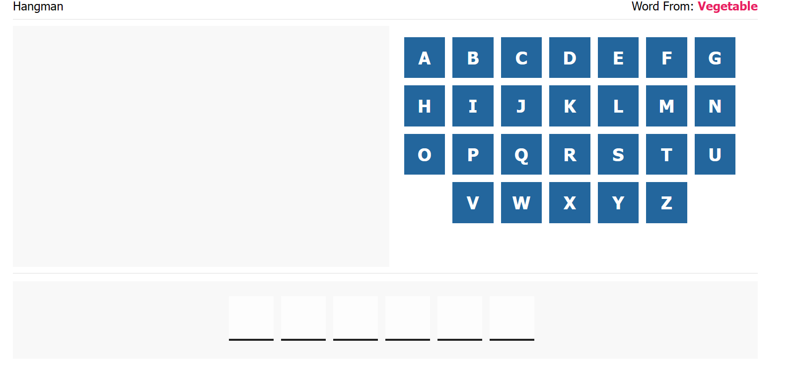
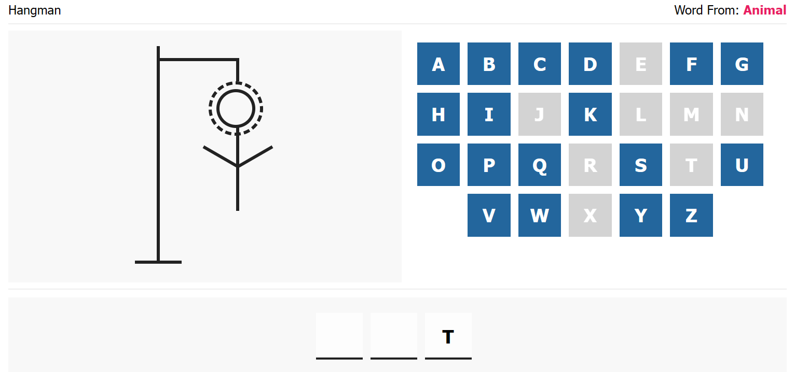
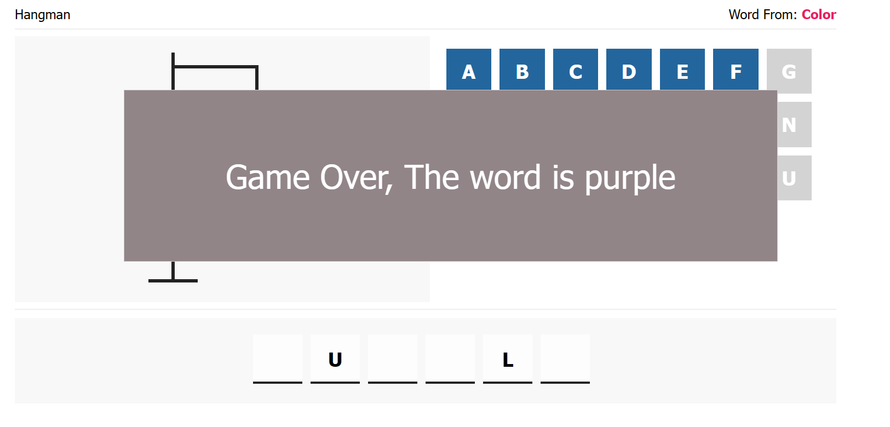

# Hangman-Game

## Description
The Hangman Game is a classic word-guessing game where players attempt to guess a hidden word one letter at a time. This project is a simple implementation of the game using HTML, CSS, and JavaScript.

## Features
Random Word Selection: The game randomly selects a word from predefined categories like animals, fruits, and more.

User Interaction: Players can click on letter boxes to make guesses.

Feedback: The game provides feedback on correct and incorrect guesses.

Hangman Drawing: A hangman drawing appears as incorrect guesses accumulate.

Winning and Losing: The game checks if the player successfully guessed the word or if they've made too many incorrect guesses.

Pop-up Messages: Informative pop-up messages display at the end of the game to notify the player of the outcome.

## How to Play
Clone this repository to your local machine.

Open the index.html file in your web browser.

Click on the letter boxes to make guesses.

Try to guess the word before you run out of incorrect attempts!

